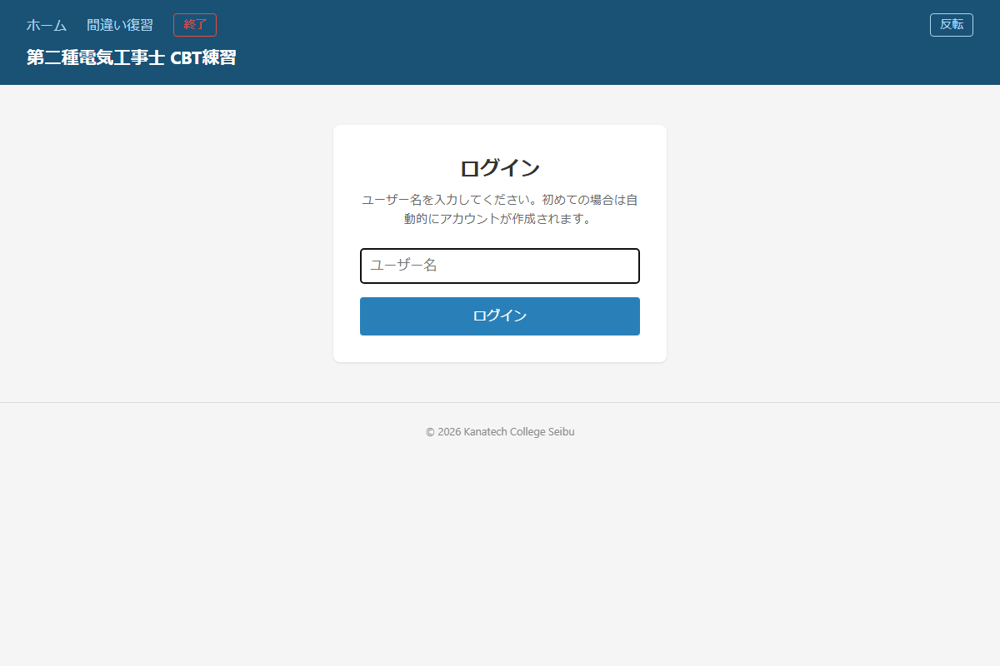
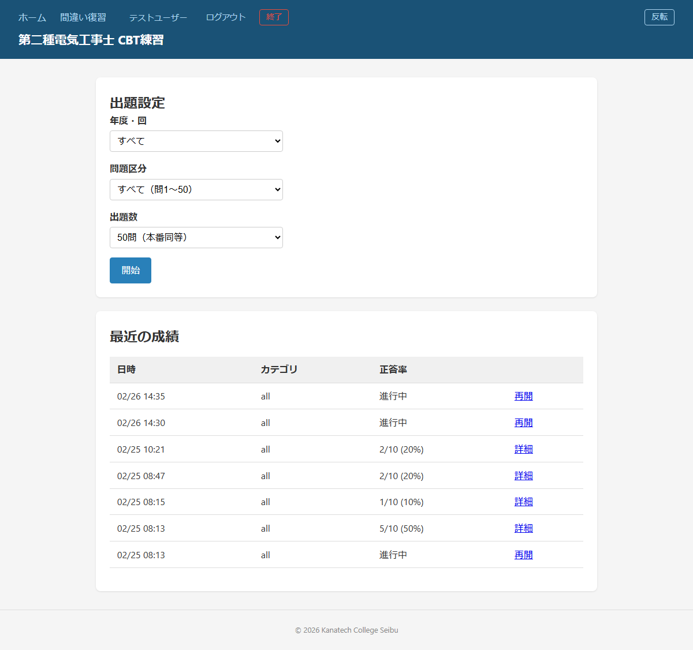
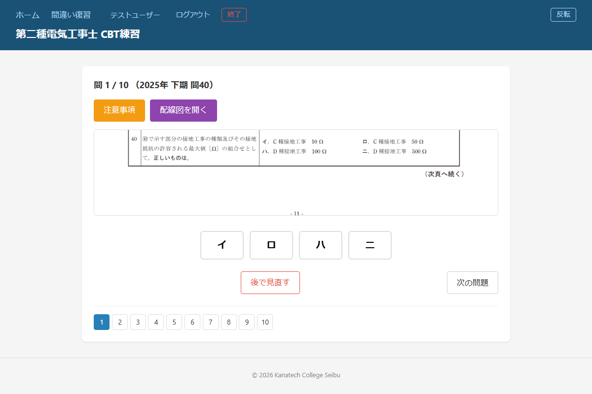
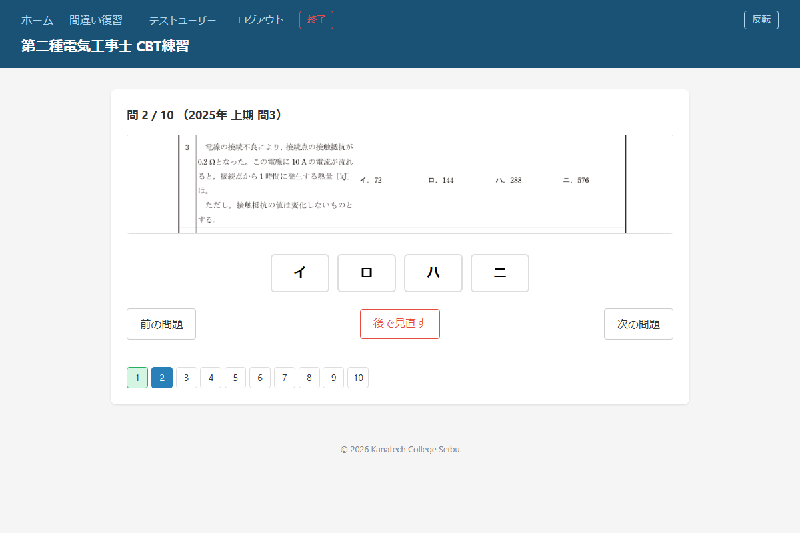
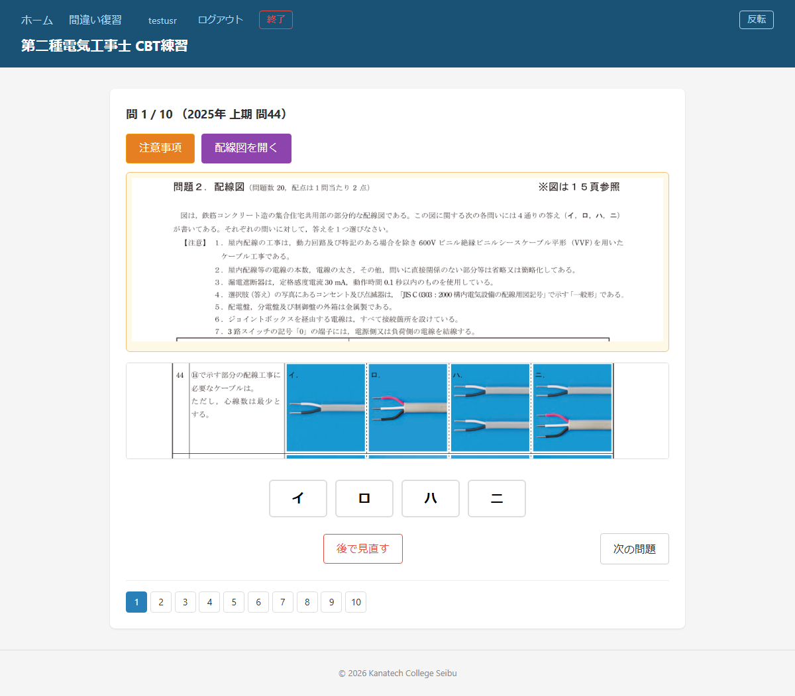
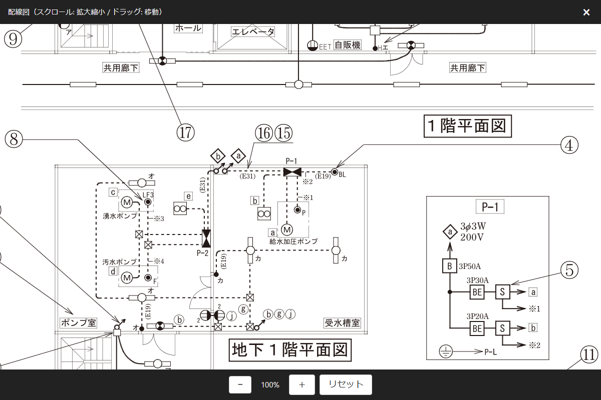
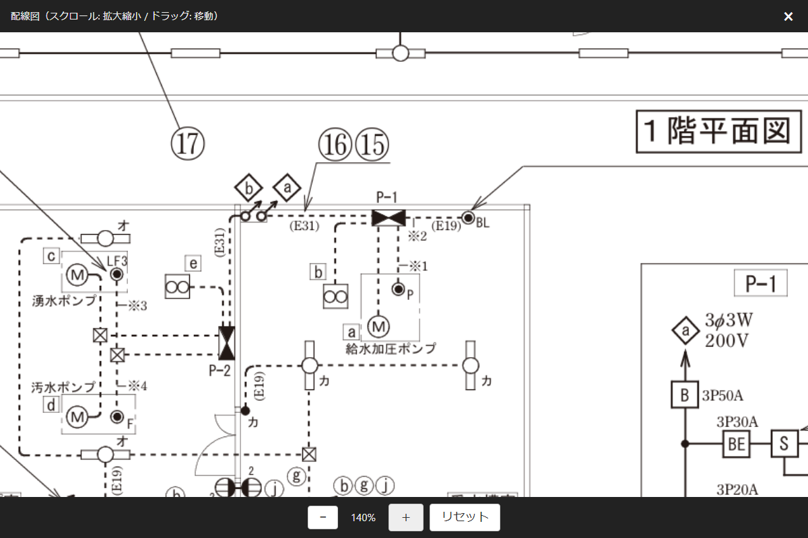
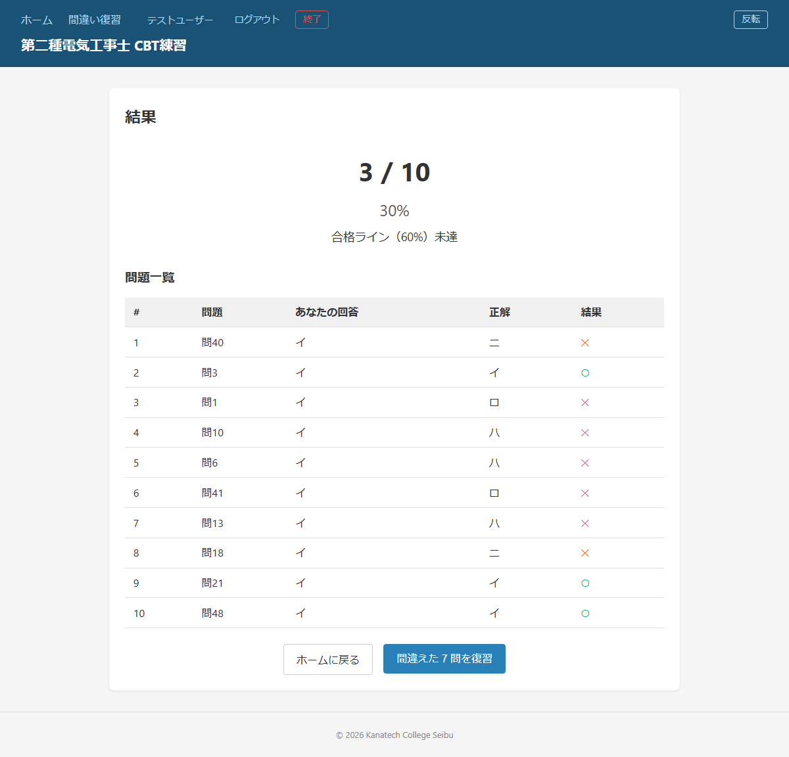
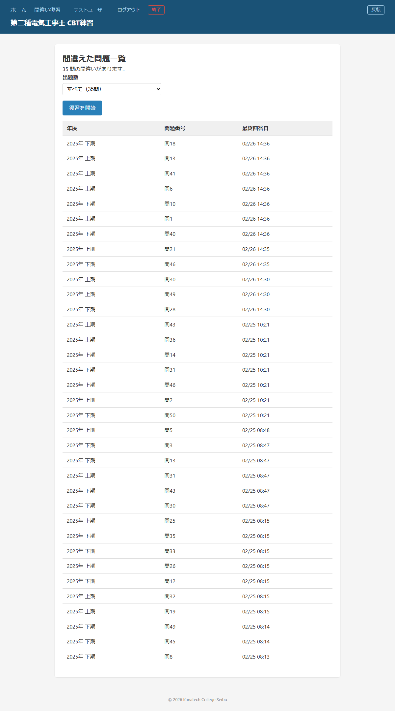

# 第二種電気工事士 CBT練習アプリ 利用マニュアル

**対象**: 第二種電気工事士 筆記試験の受験生
**バージョン**: 2026年版
© 2026 Kanatech College Seibu

---

## 目次

1. [このアプリについて](#1-このアプリについて)
2. [ログイン](#2-ログイン)
3. [ホーム画面 — 出題設定](#3-ホーム画面--出題設定)
4. [問題を解く](#4-問題を解く)
5. [配線図問題の操作](#5-配線図問題の操作)
6. [採点・結果画面](#6-採点結果画面)
7. [間違い復習](#7-間違い復習)
8. [画面表示の設定](#8-画面表示の設定)
9. [よくある質問](#9-よくある質問)

---

## 1. このアプリについて

本アプリは、第二種電気工事士の筆記試験（CBT方式）を本番に近い形式で練習するためのツールです。

- 電気技術者試験センターの**公式過去問**を収録
- 問題はPDF原本から画像として表示（本番の出題形式に忠実）
- **イ・ロ・ハ・ニ** の4択形式
- 配線図問題はズーム・スクロールで詳細確認が可能
- 回答履歴・正答率を自動記録し、苦手分野を把握できる

---

## 2. ログイン

アプリを起動するとログイン画面が表示されます。

1. **ユーザー名**を入力する（半角・全角どちらでも可）
2. **ログイン** ボタンを押す

> **ポイント**
> - パスワードは不要です。ユーザー名だけで利用できます。
> - 同じユーザー名でログインすると、過去の成績が引き継がれます。
> - 複数人で使う場合は、それぞれ別のユーザー名を使用してください。
> - 初回ログイン時はアカウントが自動的に作成されます。

---

## 3. ホーム画面 — 出題設定

ログイン後のホーム画面で出題条件を設定し、練習を開始します。

### 設定項目

| 項目 | 選択肢 | 説明 |
|------|--------|------|
| **年度・回** | 例: 2024年 上期 | 特定年度の過去問のみ出題。「すべて」を選ぶと全年度混合 |
| **問題区分** | すべて / 一般問題 / 配線図 | 出題範囲を絞り込む |
| **出題数** | 問題区分によって変わる（下表参照） | 本番は50問。短時間練習には10問・20問が便利 |

**出題数の選択肢は問題区分に連動して自動的に切り替わります。**

| 問題区分 | 出題数の選択肢 |
|----------|---------------|
| すべて（問1〜50） | 10問 / 20問 / 30問 / 50問（本番同等） |
| 一般問題（問1〜30） | 10問 / 20問 / 全30問 |
| 配線図（問31〜50） | 10問 / 全20問 |

### 問題区分について

- **すべて（問1〜50）**: 一般問題・配線図をまとめて出題（本番同等）
- **一般問題（問1〜30）**: 電気理論・機器・法規などの知識問題
- **配線図（問31〜50）**: 配線図を読み解く応用問題

### 開始方法

設定が終わったら **「開始」** ボタンを押すと問題が始まります。

### 最近の成績

ホーム画面下部には直近10回の成績が一覧表示されます。

- **詳細** リンク: 結果画面を再表示
- **再開** リンク: 中断中のセッションを途中から再開

---

## 4. 問題を解く

### 問題画面

画面は上から順に次の構成です。

| エリア | 内容 |
|--------|------|
| 左上 | 進捗（問○／○）・年度・問題番号 |
| 上部ボタン | 配線図問題のみ表示（注意事項 / 配線図を開く） |
| 中央 | 問題画像（クリックで拡大） |
| 選択肢 | イ・ロ・ハ・ニ の4択ボタン |
| 下部 | 前の問題 / 後で見直す / 次の問題 |
| 最下部 | 問題番号一覧 |

### 回答方法

1. 問題画像を確認する（クリックで拡大できます）
2. **イ・ロ・ハ・ニ** のいずれかのボタンを押す
   → 選択されたボタンが青くハイライトされます
3. 自動的に次の問題へ進みます

> **注意**: 採点は「採点する」ボタンを押したときにまとめて行われます。回答後すぐに正誤は表示されません。

### 問題番号一覧で状況を確認

画面下部の問題番号一覧で、全問の回答状況を一目で確認できます。

| 色・スタイル | 意味 |
|------------|------|
| 青背景 | 現在表示中の問題 |
| 緑背景 | 回答済みの問題 |
| 赤枠・赤文字 | 「後で見直す」マークをつけた問題 |
| 白背景 | 未回答 |

番号をクリックすると、その問題へ直接移動できます。

### 後で見直す（フラグ機能）

「後で見直す」ボタンを押すと、その問題に**赤いマーク**が付きます。
迷ったときや後でもう一度確認したい問題につけておきましょう。
もう一度押すと解除されます。

### 採点する

最後の問題で **「採点する」** ボタンを押すと結果画面へ移動します。

---

## 5. 配線図問題の操作

問31〜50の**配線図問題**では、問題上部に橙色と紫色の2つのボタンが表示されます。

### 注意事項ボタン（橙色）

「注意事項」ボタンを押すと、その配線図セクションの**共通注意事項**が問題の上に展開されます。

注意事項には、使用するケーブルの種類・接続方法・スイッチの扱いなど、そのセクション全体に共通するルールが書かれています。試験本番でも冒頭に表示されるもので、必ず読んでから各問題に取り組みましょう。
もう一度「注意事項」ボタンを押すと閉じられます。

> **ヒント**: 展開した注意事項の画像をクリック（タップ）すると、配線図と同じズーム・スクロール操作で細部を拡大表示できます。

### 配線図を開くボタン（紫色）

「配線図を開く」ボタンを押すと、配線図の**大きな画像**が画面全体に表示されます。

配線図の上部には操作方法のヒント、下部には拡大縮小ボタンが並んでいます。

| 操作 | 動作 |
|------|------|
| マウスホイール | 拡大・縮小 |
| ドラッグ | 図面をスクロール（移動） |
| **＋** ボタン | 拡大（20%ずつ） |
| **−** ボタン | 縮小（20%ずつ） |
| **リセット** ボタン | 元のサイズ・位置に戻す |
| **×** ボタン（右上） | 配線図を閉じる |

**拡大表示で細部を確認**

＋ボタンやマウスホイールで拡大すると、配線記号や接続先の文字が読みやすくなります。ドラッグで見たい箇所へ移動し、確認が終わったら右上の **×** で閉じて回答に戻ります。

---

## 6. 採点・結果画面

「採点する」を押すと結果が表示されます。

### スコア表示

画面上部に正解数・正答率・合否判定が表示されます。
本番試験の合格基準は **60%以上**（50問中30問以上の正解）です。

### 問題一覧

| 列 | 内容 |
|----|------|
| # | 出題順 |
| 問題 | 年度内の問題番号 |
| あなたの回答 | 選んだ選択肢（イ〜ニ） |
| 正解 | 正しい答え |
| 結果 | ○（正解）/ ✕（不正解） |

### 間違えた問題を復習

結果画面の下部にある **「間違えた○問を復習」** ボタンを押すと、
そのセッションで間違えた問題だけを再出題します。

> **ポイント**: 全問正解の場合、このボタンは表示されません。

---

## 7. 間違い復習

画面上部のナビゲーションから **「間違い復習」** を選ぶと、
これまでの全セッションを通じて最後に間違えた問題の一覧が表示されます。

- **年度・問題番号・最終回答日**が一覧で確認できます
- 同じ問題に複数回回答している場合は、**最新の回答結果**で判定されます
- 出題数を選んで **「復習を開始」** ボタンを押すと間違い問題のみ出題します

> 毎日10分の復習を習慣にすると、苦手問題が徐々に減っていきます。

---

## 8. 画面表示の設定

### 白黒反転モード

ナビゲーションバーの **「反転」** ボタンを押すと、画面の色を反転できます。
暗い場所での学習や、目の疲れを感じたときに便利です。
「通常」ボタンを押すと元に戻ります。設定はブラウザに記憶されます。

### アプリの終了（EXE版のみ）

EXE版（スタンドアロン）を使用している場合、ナビゲーションバーに **「終了」** ボタンが表示されます。
押すと確認ダイアログが表示され、OKでアプリが終了します。

---

## 9. よくある質問

**Q. パスワードを忘れました**
A. パスワードは設定されていません。登録時のユーザー名を入力するだけでログインできます。

**Q. 途中でブラウザを閉じてしまいました**
A. 回答済みの内容は自動保存されています。ホーム画面の「最近の成績」から「再開」を押せば続きから始められます。

**Q. 問題画像が見づらいです**
A. 問題画像をクリック（タップ）すると拡大表示できます。また「反転」モードも試してみてください。

**Q. 正解がわかりません（解説はありますか？）**
A. 本アプリは過去問の選択肢と正解番号を収録していますが、詳細な解説は掲載していません。正解を確認した上で、公式テキストや解説書を参照してください。

**Q. 本番試験と全く同じ問題が出ますか？**
A. 電気技術者試験センター公表の過去問PDFから抽出した問題を収録しています。問題画像はPDFから直接変換したものです。

---

*© 2026 Kanatech College Seibu*
